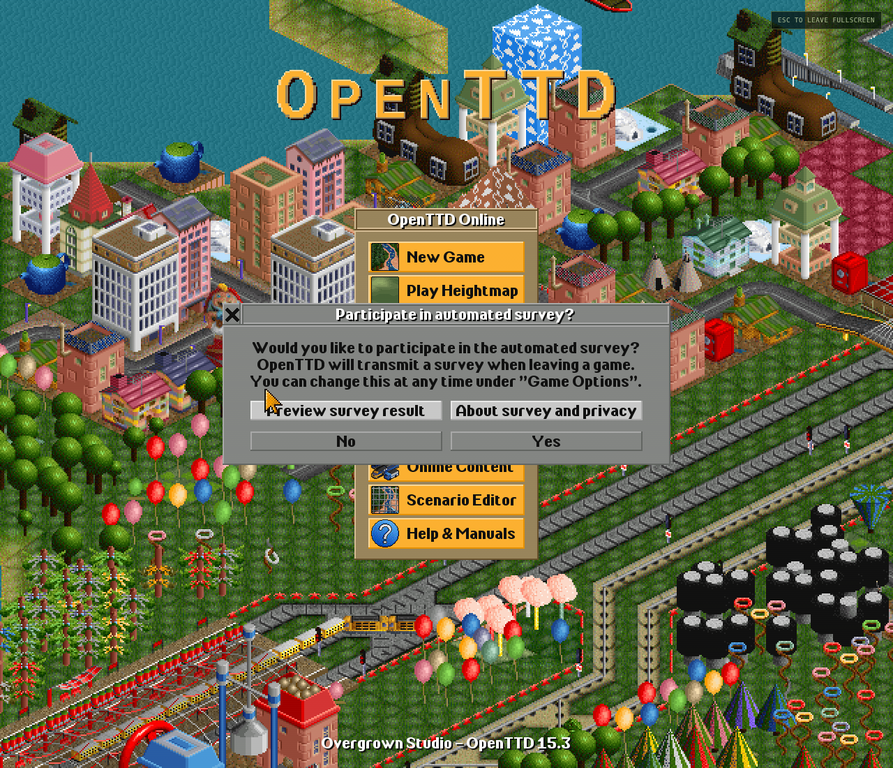
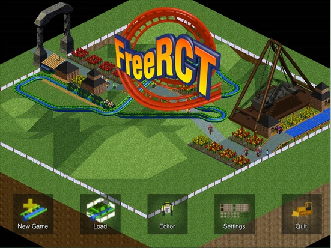

<div align="center">

# RetroPlay

> **Classic worlds, ready to play.**
>
> A curated browser hub for open-source retro games, classic engines and WAD worlds that run through WebAssembly.

[](https://mahankenway.github.io/DOOM/)
[](../../actions/workflows/build-and-deploy.yml)
[](https://pages.github.com/)

[](https://webassembly.org/)
[](https://emscripten.org/)
[](https://pages.github.com/)
[](#licensing-and-attribution)

[**Open RetroPlay**](https://mahankenway.github.io/DOOM/) · [**Browse the catalog**](https://mahankenway.github.io/DOOM/#catalog) · [**Report an issue**](../../issues) · [**View releases**](../../actions)

</div>

---

[](https://mahankenway.github.io/DOOM/openttd.html)

## A browser-first retro game collection

**RetroPlay** is no longer only a Doom WAD launcher. It is a deliberately small, curated collection of independently built browser runtimes: first-person action, top-down combat, adventure, shooters, transport strategy and theme-park strategy. The shell provides discovery, a local library and PSP-inspired touch controls; each game runtime owns its engine, data path and persistence model.

> **Design rule:** a game marked **Ready** includes the free content it needs and launches from the browser. It does not ask the player to upload a commercial archive, create an account or install a native application.

The project is published as a static GitHub Pages site. Its browser runtimes use WebAssembly, a web standard intended to run compiled code efficiently in the browser [1], with Emscripten used by the project’s C and C++ build paths [2]. GitHub Actions builds the deployable artifact and GitHub Pages serves the static result [3].

| Area | What RetroPlay provides |
|---|---|
| **Discover** | A searchable catalog that combines classic WAD material with standalone, free-content games. |
| **Play** | One click opens the relevant browser runtime; bundled entries are designed to start on first load. |
| **Control** | Keyboard, mouse and desktop gamepad support alongside PSP-style touch controls on supported runtimes. |
| **Keep progress** | Game-specific browser-local persistence, plus the hub’s local library and settings. |
| **Respect rights** | Source, asset and license notices remain with each runtime; no commercial game data is repackaged. |

## Live runtime index

The ready entries below are the current focus of the project. Each has a direct link from the main catalog and a dedicated runtime page.

| Runtime | Genre | Content status | Direct page |
|---|---|---|---|
| **Doom / Freedoom catalog** | First-person action | Free WAD bundles and optional local WAD tooling | [Open catalog](https://mahankenway.github.io/DOOM/) |
| **C-Dogs SDL** | Top-down action | Ready with libre upstream game data | [Launch C-Dogs](https://mahankenway.github.io/DOOM/cdogs.html) |
| **GNU FreeDink** | Action-adventure | Ready with redistributable game data | [Launch FreeDink](https://mahankenway.github.io/DOOM/freedink.html) |
| **OpenTyrian2000** | Vertical shooter | Ready with documented freeware data | [Launch OpenTyrian](https://mahankenway.github.io/DOOM/opentyrian.html) |
| **LibreQuake** | First-person action | Ready with LibreQuake Lite data | [Launch LibreQuake](https://mahankenway.github.io/DOOM/librequake.html) |
| **OpenTTD** | Transport strategy | Ready with OpenGFX, OpenSFX and OpenMSX | [Launch OpenTTD](https://mahankenway.github.io/DOOM/openttd.html) |
| **FreeRCT** | Theme-park strategy | Ready with clean-room, free game data | [Launch FreeRCT](https://mahankenway.github.io/DOOM/freerct.html) |

Two deliberately limited pages remain visible for transparency. **ECWolf** is an engine-only browser host and therefore requires lawfully obtained compatible data selected locally; it is not represented as a zero-friction bundled game. **OpenResident** is a WebGL2/WebAssembly technical probe, not a playable Resident Evil distribution, because its upstream engine source contains no game data.

## Real gameplay, not promotional art

All catalog and README visuals are sourced from actual game or local browser-runtime captures. The images below show two of the fully bundled strategy runtimes running in their native interfaces.

| OpenTTD browser runtime | FreeRCT browser runtime |
|---|---|
| [](https://mahankenway.github.io/DOOM/openttd.html) | [](https://mahankenway.github.io/DOOM/freerct.html) |
| **OpenTTD** uses its free graphics, effects and music sets. | **FreeRCT** uses its project-generated clean-room graphics and data. |

## Playing RetroPlay

Start at the [main hub](https://mahankenway.github.io/DOOM/), select a **Ready** game card and choose its launch action. The hub opens independent runtimes in their own pages when the game requires a different engine. On mobile, use the visible D-pad, face buttons and shoulder controls where supplied; on desktop, click the game canvas once if the runtime asks to capture pointer input.

| Task | Recommended action |
|---|---|
| **Play a bundled title** | Select a game marked **Free / bundled** or **Ready**, then use its launch action. |
| **Enter fullscreen** | Use the runtime’s **Fullscreen** control after the canvas has initialized. |
| **Save progress** | Let the game use browser-local storage; do not clear site data if you want to retain saves. |
| **Use a Doom mapset you own** | Use the separate local WAD importer on the main hub. Files stay in the browser session and are never uploaded to a RetroPlay server. |
| **Find a game** | Use catalog search, genre filters and the local pinned library. |

## Runtime architecture

RetroPlay intentionally does not force all games through one emulation layer. The hub is static HTML, CSS and ES modules; the individual runtime pages load their own WebAssembly build and assets. This isolates dependencies and lets each classic engine keep its natural rendering, audio and input model.

```text
Browser
├── RetroPlay hub
│   ├── index.html + styles/ + src/
│   ├── catalog search, filtering and local library
│   └── Doom WAD runtime and optional local WAD importer
│
├── Independent WebAssembly runtime pages
│   ├── cdogs.html       → C-Dogs SDL
│   ├── freedink.html    → GNU FreeDink
│   ├── opentyrian.html  → OpenTyrian2000
│   ├── librequake.html  → LibreQuake / Qwasm
│   ├── openttd.html     → OpenTTD + free base sets
│   ├── freerct.html     → FreeRCT + clean-room game data
│   └── ecwolf.html      → ECWolf engine host
│
└── GitHub Actions
    ├── compiles and packages runtime assets
    ├── copies the static hub into dist/
    └── deploys the artifact to GitHub Pages
```

| Directory | Responsibility |
|---|---|
| [`src/`](src/) | Hub catalog, UI behavior, Doom runtime bridge and browser persistence. |
| [`styles/`](styles/) | The shared PSP-inspired visual system. |
| [`scripts/`](scripts/) | Reproducible builders and validation utilities for browser runtimes. |
| [`linuxdoom-1.10/`](linuxdoom-1.10/) | Doom source and browser-specific platform layer. |
| [`third_party/`](third_party/) | License-preserving upstream source material and adapters. |
| [`.github/workflows/`](.github/workflows/) | The reproducible GitHub Actions build-and-deploy workflow. |
| [`docs/`](docs/) | Research, feasibility notes and runtime test records. |

## Build and deployment

The authoritative build is [`.github/workflows/build-and-deploy.yml`](.github/workflows/build-and-deploy.yml). On a push to `main` or `master`, it installs the pinned Emscripten SDK, packages the redistributable content, compiles the engine modules, copies the static frontend to `dist/` and deploys the artifact to GitHub Pages.

```bash
git clone https://github.com/MahanKenway/DOOM.git
cd DOOM

# The repository is a static frontend. To inspect an already generated artifact locally:
python3 -m http.server 4180 --directory dist
# Then visit http://localhost:4180/
```

A complete local rebuild needs the pinned Emscripten toolchain plus the prerequisites used by the individual scripts. Use the same order as CI when validating a substantive engine change:

```bash
# After activating a compatible Emscripten environment:
./scripts/build-cdogs-web.sh
./scripts/build-freedink-web.sh
./scripts/build-opentyrian-web.sh
./scripts/build-liberquake-web.sh
./scripts/build-openttd-web.sh
./scripts/build-freerct-web.sh
./scripts/build-ecwolf-web.sh
```

Do not commit generated `dist/` content. It is a deployment artifact and is rebuilt by CI. For a documentation-only or hub-only change, push to the deployment branch and use the workflow run as the canonical build check.

## Quality and contribution expectations

A contribution should preserve the project’s practical rules: the public build must remain static, an advertised **Ready** runtime must launch with its included lawful content, touch controls must not compromise desktop input, and fullscreen must be exercised before a release. Use actual gameplay captures for catalog art; generated concept art does not substitute for a runtime screenshot.

| Change type | Expected evidence before merge |
|---|---|
| Hub copy, catalog or styling | No broken navigation, correct title/metadata and a checked build artifact. |
| New ready-to-play runtime | Reproducible script, license/source notice, browser launch test, fullscreen test and real screenshot. |
| Runtime control change | Desktop input check and a touch interaction check on the runtime page. |
| Asset/data addition | Clear upstream provenance, license compatibility and no requirement for a player to upload proprietary files. |

Open an [issue](../../issues) for defects, compatibility reports or candidate free-content runtimes. Pull requests should keep attribution files intact and describe both the technical change and the runtime verification performed.

## Licensing and attribution

RetroPlay is a **non-commercial** deployment. The hub does not claim ownership of the engines, game data or artwork represented in the catalog. Each package remains subject to its own license and attribution obligations; the repository keeps runtime-specific notices alongside the relevant bundles and source material.

| Component | Primary licensing / attribution path |
|---|---|
| Hub frontend and browser integration | [`LICENSE`](LICENSE) |
| Doom source lineage | [DOOM source license](https://github.com/id-Software/DOOM/blob/master/doomlic.txt) |
| Freedoom and FreeDM bundles | [Freedoom project](https://freedoom.github.io/) [4] |
| C-Dogs SDL | [C-Dogs SDL source](https://github.com/cxong/cdogs-sdl) [5] |
| GNU FreeDink | [GNU FreeDink project](https://www.gnu.org/software/freedink/) [6] |
| OpenTyrian2000 | [OpenTyrian2000 source](https://github.com/opentyrian/opentyrian) [7] |
| LibreQuake | [LibreQuake project](https://librequake.github.io/) [8] |
| OpenTTD and base sets | [OpenTTD](https://www.openttd.org/) [9] |
| FreeRCT | [FreeRCT source](https://github.com/FreeRCT/FreeRCT) [10] |
| ECWolf | [`ecwolf/`](ecwolf/) notices and its upstream project |

For the historical legal and technical decision not to package OpenRCT2 or proprietary RollerCoaster Tycoon data, see [`docs/openrct2-runtime-feasibility.md`](docs/openrct2-runtime-feasibility.md).

## References

[1] [WebAssembly — official overview](https://webassembly.org/)

[2] [Emscripten documentation](https://emscripten.org/docs/)

[3] [GitHub Pages documentation](https://docs.github.com/pages)

[4] [Freedoom project](https://freedoom.github.io/)

[5] [C-Dogs SDL source repository](https://github.com/cxong/cdogs-sdl)

[6] [GNU FreeDink](https://www.gnu.org/software/freedink/)

[7] [OpenTyrian source repository](https://github.com/opentyrian/opentyrian)

[8] [LibreQuake project](https://librequake.github.io/)

[9] [OpenTTD project](https://www.openttd.org/)

[10] [FreeRCT source repository](https://github.com/FreeRCT/FreeRCT)

---

<div align="center">

Built and maintained by [MahanKenway](https://github.com/MahanKenway). RetroPlay is a preservation-minded, non-commercial experiment in making free classic game worlds easier to explore.

</div>
